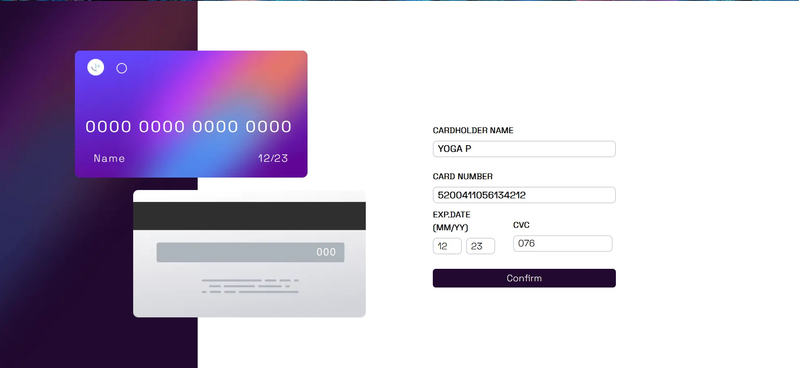
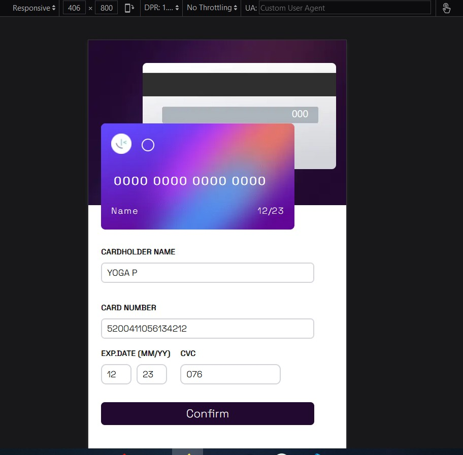
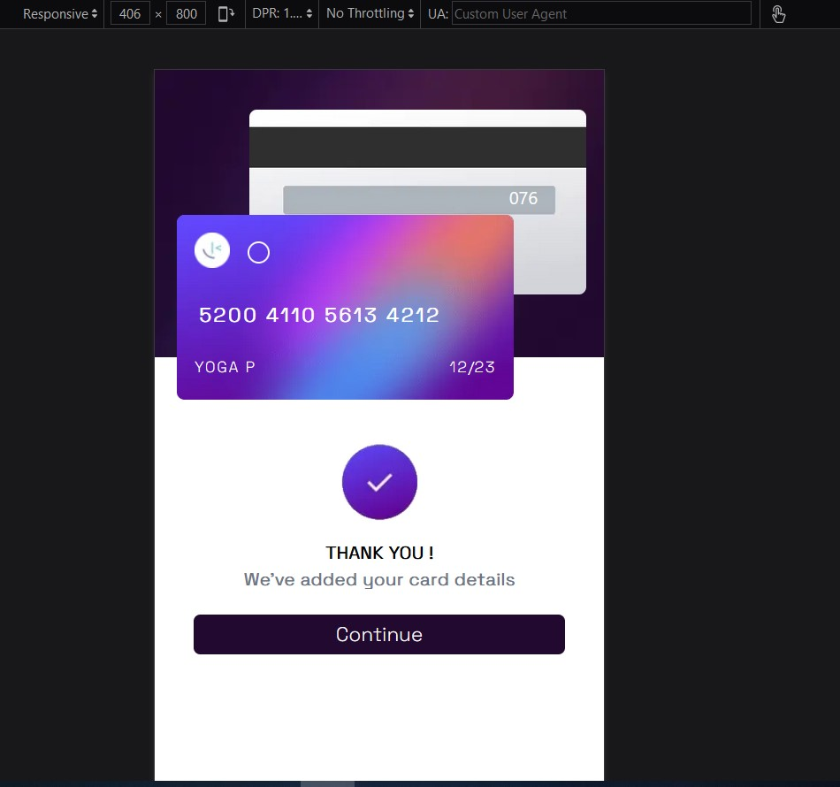

# Frontend Mentor - Interactive card details form solution

This is a solution to the [Interactive card details form challenge on Frontend Mentor](https://www.frontendmentor.io/challenges/interactive-card-details-form-XpS8cKZDWw). Frontend Mentor challenges help you improve your coding skills by building realistic projects.

## Table of contents

- [The challenge](#the-challenge)
- [Screenshot](#screenshot)
- [My process](#my-process)
  - [Built with](#built-with)
  - [What I learned](#what-i-learned)
  - [Continued development](#continued-development)
  - [Useful resources](#useful-resources)
- [Author](#author)
- [Acknowledgments](#acknowledgments)

**Note: Delete this note and update the table of contents based on what sections you keep.**

### The challenge

Users should be able to:

- Fill in the form and see the card details update in real-time
- Receive error messages when the form is submitted if:
  - Any input field is empty
  - The card number, expiry date, or CVC fields are in the wrong format
- View the optimal layout depending on their device's screen size
- See hover, active, and focus states for interactive elements on the page

### Screenshot






## My process

### Built with

- Semantic HTML5 markup
- Tailwind
- Flexbox
- [Next.js](https://nextjs.org/) - React framework

### What I learned

I learn how to use a Useform, UseState, and UseEffect. I also learned how to do simple verification and forms

in this code below i learn how to use regex to check if input has only letters inside it, although i still unable to check if input has numbers only.
```js
const validateForm = () => {
  const letters = /^[A-Za-z ]+$/;
  const name = document.getElementById("name");

  if (name.value.match(letters)) {
    return true;
  } else {
    alert("Name only accepts alphabet letters");
    return false;
  }
};
```
## Author

- Website - [Add your name here](https://www.your-site.com)
- Frontend Mentor - [@Yoga723](https://www.frontendmentor.io/profile/Yoga723)


## Acknowledgments

This is where you can give a hat tip to anyone who helped you out on this project. Perhaps you worked in a team or got some inspiration from someone else's solution. This is the perfect place to give them some credit.

**Note: Delete this note and edit this section's content as necessary. If you completed this challenge by yourself, feel free to delete this section entirely.**
